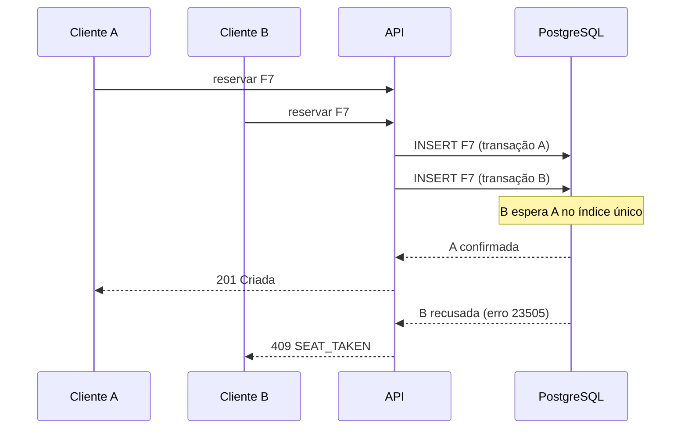

# 🎬 Cine Aurora — Plataforma de Reservas de Cinema

Aplicação full stack para reserva de ingressos: o cliente navega pelos filmes em cartaz, escolhe o
dia num calendário de disponibilidade e seleciona poltronas num mapa em tempo real, com três
categorias de assento (Normal, Semi-VIP e VIP). Administradores gerenciam filmes, salas e sessões
por um painel próprio.


<!--
  CAPTURAS DE TELA
  Salve as imagens em docs/screenshots/ e descomente o bloco abaixo.
  Sugestão de telas: home, mapa de poltronas com seleção, checkout com cronômetro, painel admin.

<p align="center">
  
  
</p>
<p align="center">
  
  
</p>
-->

---

## Sumário

- [Funcionalidades](#funcionalidades)
- [Destaques técnicos](#destaques-técnicos)
- [Tecnologias](#tecnologias)
- [Como rodar o projeto](#como-rodar-o-projeto)
- [Rodando os testes](#rodando-os-testes)
- [Solução de problemas](#solução-de-problemas)
- [Scripts disponíveis](#scripts-disponíveis)
- [Estrutura do projeto](#estrutura-do-projeto)
- [Segurança e desempenho](#segurança-e-desempenho)
- [Próximos passos](#próximos-passos)

---

## Funcionalidades

**Para o cliente**

- Catálogo de filmes em cartaz com **busca textual** (título, diretor, gênero ou trecho da sinopse — funciona sem acento)
- **Filtros combináveis** por gênero, classificação indicativa, formato (2D, 3D, IMAX, 4DX) e sala, salvos na URL
- **Calendário de disponibilidade** com os próximos 14 dias que têm sessão
- **Mapa de poltronas** com status em tempo real, preço por categoria e poltronas acessíveis
- Ingresso inteira ou meia por poltrona, até 6 lugares por reserva
- Reserva segura as poltronas por **10 minutos**, com cronômetro até a confirmação
- Histórico em "Minhas reservas", com código de retirada e cancelamento

**Para o administrador**

- Painel com ocupação do dia e sessões mais cheias
- **CRUD completo** de filmes, salas e sessões
- Criação de sala com **prévia do mapa de poltronas** gerado automaticamente
- Agendamento de sessões com recusa automática de horários conflitantes

---

## Destaques técnicos

### A mesma poltrona nunca é vendida duas vezes

Checar disponibilidade no código e depois gravar não resolve: entre a verificação e a gravação,
outra requisição cabe no meio. Aqui quem decide é o banco, com um índice único parcial:

```sql
CREATE UNIQUE INDEX reservation_seats_assento_ocupado_idx
ON reservation_seats (showtime_id, seat_id) WHERE NOT released;
```



O script `tools/teste-concorrencia.mjs` dispara 25 reservas **simultâneas** na mesma poltrona.
O resultado é sempre o mesmo: 1 criada, 24 recusadas.

### Sessões nunca se sobrepõem na mesma sala

Uma constraint `EXCLUDE USING gist` compara os intervalos de horário no próprio banco. Nem uma
chamada direta à API consegue agendar um filme por cima de outro.

### O preço nunca vem do navegador

A requisição informa apenas *quais* poltronas. O valor é calculado dentro do `INSERT`, a partir
do preço-base da sessão e do multiplicador da categoria (Normal ×1,0 · Semi-VIP ×1,4 · VIP ×1,9
· meia ×0,5). Se o preço viesse no corpo da requisição, bastaria editá-lo no DevTools.

### Sessão protegida contra roubo de token

Access token de 15 minutos guardado só em memória e refresh token em cookie `httpOnly`, trocado
a cada uso. Se um refresh token já usado reaparecer, todas as sessões daquela linhagem são
derrubadas.

---

## Tecnologias

| Camada | Tecnologias |
|---|---|
| **Backend** | Node.js, Express, TypeScript, Zod, JWT, bcrypt, Helmet, express-rate-limit |
| **Banco de dados** | PostgreSQL 16 com SQL puro (`pg`), node-pg-migrate, busca full-text com `unaccent` |
| **Frontend** | React 19, Vite, Tailwind CSS 4, React Router 7, TanStack Query, Zustand, Axios |
| **Testes** | Vitest, Supertest |
| **Infraestrutura** | Docker Compose (PostgreSQL + Adminer), documentação OpenAPI/Swagger |

---

## Como rodar o projeto

O passo a passo usa o **terminal integrado do VSCode** (menu *Terminal → Novo Terminal*).
Os comandos funcionam no PowerShell (padrão do Windows), no Git Bash e no terminal do macOS/Linux.

### Pré-requisitos

| Ferramenta | Versão | Download |
|---|---|---|
| Node.js | 20.19 ou superior (recomendado 22 LTS) | [nodejs.org](https://nodejs.org/) |
| Docker Desktop | qualquer versão recente | [docker.com](https://www.docker.com/products/docker-desktop/) |
| Git | qualquer versão recente | [git-scm.com](https://git-scm.com/) |

Confira as instalações:

```bash
node -v
docker -v
git --version
```

> **Não precisa instalar o PostgreSQL.** O banco roda dentro do Docker.

### 1. Clone o repositório

```bash
git clone https://github.com/arthur-risso/cine_reservas.git
cd cine_reservas
code .
```

### 2. Suba o banco de dados

Abra o **Docker Desktop** e espere ele indicar que está rodando. Depois, na raiz do projeto:

```bash
docker compose up -d
```

Confira se os dois containers estão de pé:

```bash
docker compose ps
```

✅ Você deve ver `cinema_db` e `cinema_adminer` com status `Up`.

Na primeira execução o Docker baixa as imagens (pode levar alguns minutos) e cria dois bancos:
`cinema_db`, usado pela aplicação, e `cinema_test`, usado pelos testes automatizados.

### 3. Configure as variáveis de ambiente do backend

```bash
cd backend
cp .env.example .env
```

Abra o arquivo `backend/.env` no VSCode. Os campos `JWT_ACCESS_SECRET` e `JWT_REFRESH_SECRET`
estão vazios e **precisam ser preenchidos** — sem eles o servidor não inicia.

Gere um valor aleatório com o comando abaixo e cole em `JWT_ACCESS_SECRET`:

```bash
node -e "console.log(require('crypto').randomBytes(48).toString('base64url'))"
```

Rode o comando **de novo** e cole o segundo valor em `JWT_REFRESH_SECRET`. Os dois precisam ser
diferentes. No arquivo, fica assim:

```env
JWT_ACCESS_SECRET=<primeiro-valor-gerado>
JWT_REFRESH_SECRET=<segundo-valor-gerado>
```

> ⚠️ Cada pessoa gera os próprios segredos. O `.env` já está no `.gitignore` e nunca deve ser
> enviado ao GitHub.

As demais variáveis já vêm prontas para o ambiente local.

### 4. Instale as dependências e prepare o banco

Ainda dentro de `backend`:

```bash
npm install
npm run migrate:up
npm run seed
```

- `migrate:up` cria as tabelas, índices e constraints.
- `seed` popula o banco com 12 filmes, 4 salas, 500 poltronas e cerca de 170 sessões nos próximos 14 dias.

✅ O seed termina mostrando um resumo e as contas de demonstração.

### 5. Inicie a API

```bash
npm run dev
```

✅ Você deve ver:

```
[db] conexão com o PostgreSQL estabelecida
[api] http://localhost:3333  (development)
```

**Deixe este terminal aberto.**

### 6. Inicie o frontend

Abra um **segundo terminal** (botão `+` no painel do terminal) e, a partir da raiz do projeto:

```bash
cd frontend
npm install
npm run dev
```

✅ O Vite mostra `Local: http://localhost:5173/`.

### 7. Acesse a aplicação

Abra **http://localhost:5173** no navegador.

| Serviço | Endereço |
|---|---|
| Aplicação | http://localhost:5173 |
| API | http://localhost:3333 |
| Documentação interativa da API | http://localhost:3333/api/docs/ui |
| Adminer (visualizar o banco) | http://localhost:8080 |

**Contas de demonstração**

| Perfil | E-mail | Senha |
|---|---|---|
| Cliente | `cliente@cinema.dev` | `Cliente@12345` |
| Administrador | `admin@cinema.dev` | `Admin@12345` |

Na tela de login, em modo de desenvolvimento, há atalhos que preenchem essas contas com um clique.
O painel administrativo fica em `/admin` e só aparece para a conta de administrador.

<details>
<summary><b>Acessar o banco pelo Adminer</b></summary>

| Campo | Valor |
|---|---|
| Sistema | PostgreSQL |
| Servidor | `db` |
| Usuário | `cinema_user` |
| Senha | `cinema_pass` |
| Base de dados | `cinema_db` |

O servidor é `db` (e não `localhost`) porque o Adminer roda dentro da rede do Docker.

</details>

### Nas próximas vezes

Depois da primeira configuração, basta:

```bash
# 1. Com o Docker Desktop aberto, na raiz do projeto
docker compose up -d

# 2. Terminal 1
cd backend
npm run dev

# 3. Terminal 2
cd frontend
npm run dev
```

---

## Rodando os testes

Os testes usam o banco `cinema_test`, separado do banco da aplicação — rodá-los **não apaga** os
dados do seed.

Na primeira vez, crie as tabelas no banco de testes:

```bash
cd backend
npm run migrate:test
```

Depois, sempre que quiser rodar a suíte:

```bash
npm test
```

✅ Resultado esperado: `Tests  32 passed (32)`.

Os testes cobrem concorrência na reserva, cálculo de preço no servidor, sobreposição de sessões,
rotação de refresh token, controle de acesso por perfil, checagem de dono da reserva e busca sem
acento.

### Teste de concorrência real

Com a API rodando (`npm run dev`), em outro terminal na raiz do projeto:

```bash
node tools/teste-concorrencia.mjs 25
```

```
Criadas (201) ..... 1
Conflitos (409) ... 24   SEAT_TAKEN
APROVADO: exatamente uma reserva venceu a disputa. Sem overbooking.
```

> O script cria uma reserva de verdade. Rode `npm run seed` depois se quiser o mapa limpo.

---

## Solução de problemas

<details>
<summary><b><code>error during connect</code> ou <code>cannot find the file specified</code> ao rodar o Docker</b></summary>

O Docker Desktop não está aberto. Inicie o aplicativo, espere o ícone indicar que está rodando e
repita `docker compose up -d`.

</details>

<details>
<summary><b><code>Configuração inválida no .env</code> ao iniciar a API</b></summary>

Os segredos JWT estão vazios ou têm menos de 32 caracteres. Refaça o
[passo 3](#3-configure-as-variáveis-de-ambiente-do-backend). A mensagem indica exatamente qual
variável está errada.

</details>

<details>
<summary><b><code>ECONNREFUSED</code> ou <code>falha ao iniciar</code> na API</b></summary>

O banco não está acessível. Verifique com `docker compose ps` se `cinema_db` está rodando.
Se o Docker acabou de iniciar, aguarde alguns segundos e tente de novo.

</details>

<details>
<summary><b><code>autenticação do tipo senha falhou</code> / <code>password authentication failed</code></b></summary>

Este projeto expõe o Postgres na porta **5433**, não na 5432. Se o `DATABASE_URL` do seu `.env`
estiver com `5432`, a conexão cai num PostgreSQL instalado no seu computador, que não conhece o
usuário `cinema_user`. Confira se a URL termina em `localhost:5433/cinema_db`.

</details>

<details>
<summary><b><code>EADDRINUSE: address already in use :::3333</code></b></summary>

Já existe uma API rodando nessa porta, provavelmente num terminal esquecido. Feche o outro
terminal ou encerre o processo com `Ctrl + C` nele.

</details>

<details>
<summary><b><code>database "cinema_test" does not exist</code> ao rodar os testes</b></summary>

O banco de testes é criado automaticamente só na **primeira** vez que o volume do Docker é criado.
Se o seu volume é anterior a isso, crie o banco manualmente e rode as migrations:

```bash
docker exec cinema_db createdb -U cinema_user cinema_test
cd backend
npm run migrate:test
```

</details>

<details>
<summary><b>Quero apagar tudo e começar do zero</b></summary>

```bash
docker compose down -v
docker compose up -d
```

O `-v` remove o volume com todos os dados. Depois, refaça `npm run migrate:up`, `npm run seed` e
`npm run migrate:test` dentro de `backend`.

</details>

---

## Scripts disponíveis

**Backend** (`cd backend`)

| Comando | O que faz |
|---|---|
| `npm run dev` | Inicia a API com recarregamento automático |
| `npm run migrate:up` | Aplica as migrations no banco da aplicação |
| `npm run migrate:down` | Desfaz a última migration |
| `npm run migrate:test` | Aplica as migrations no banco de testes |
| `npm run seed` | Apaga e recria os dados de demonstração |
| `npm test` | Roda os testes automatizados |
| `npm run build` | Compila o TypeScript para `dist/` |
| `npm start` | Roda a versão compilada |

**Frontend** (`cd frontend`)

| Comando | O que faz |
|---|---|
| `npm run dev` | Inicia o frontend em modo de desenvolvimento |
| `npm run build` | Verifica os tipos e gera o build de produção |
| `npm run preview` | Serve o build de produção localmente |
| `npm run lint` | Analisa o código com ESLint |

**Utilitários** (na raiz)

| Comando | O que faz |
|---|---|
| `node tools/teste-concorrencia.mjs 25` | Dispara reservas simultâneas na mesma poltrona |
| `node tools/generate-posters.mjs` | Regera os pôsteres SVG do catálogo |

---

## Estrutura do projeto

```
cine_reservas/
├── docker-compose.yml          # PostgreSQL + Adminer
├── docker/postgres-init/       # cria o banco de testes na primeira inicialização
├── tools/                      # teste de concorrência e gerador de pôsteres
│
├── backend/
│   ├── migrations/             # schema versionado
│   ├── tests/                  # Vitest + Supertest
│   └── src/
│       ├── config/env.ts       # valida as variáveis de ambiente ao iniciar
│       ├── db/                 # pool de conexões, transações e seed
│       ├── middlewares/        # autenticação, perfis, validação, erros, rate limit
│       ├── docs/               # especificação OpenAPI
│       ├── jobs/               # expiração de reservas pendentes
│       └── modules/
│           ├── auth/
│           ├── movies/
│           ├── rooms/
│           ├── showtimes/
│           └── reservations/
│
└── frontend/
    ├── public/posters/         # pôsteres do catálogo em SVG
    └── src/
        ├── api/                # cliente HTTP com renovação automática de sessão
        ├── app/                # rotas e proteção por perfil
        ├── components/         # design system (botões, campos, modal, avisos)
        ├── features/           # componentes de domínio (mapa de poltronas, calendário)
        ├── pages/              # telas, incluindo o painel /admin
        └── stores/             # estado de sessão e notificações
```

Cada módulo do backend segue a mesma organização:
**routes** (rotas) → **controller** (HTTP) → **service** (regras de negócio) →
**repository** (SQL), com **schema** (validação Zod) na entrada.

---

## Segurança e desempenho

**Segurança**

- Todas as queries parametrizadas — sem espaço para SQL injection
- Senhas com bcrypt (custo 12) e rate limit de 10 tentativas de login a cada 15 minutos
- Mesma mensagem e mesmo tempo de resposta para e-mail inexistente e senha errada
- Cookie de sessão `httpOnly` + `SameSite=Strict` contra XSS e CSRF
- Perfil de administrador verificado no servidor, e o cadastro ignora tentativas de enviar `role`
- Checagem de dono em toda operação sobre uma reserva
- Headers de segurança com Helmet, CORS restrito e corpo das requisições limitado a 100 KB

**Desempenho**

- Busca com índice GIN sobre `tsvector`, em vez de `LIKE '%termo%'`
- Mapa com 500 poltronas carregado em uma única consulta
- Total da paginação na mesma consulta da listagem (`count(*) OVER()`)
- Carregamento de código por rota no frontend e cache de dados com TanStack Query
- Busca com debounce de 300 ms e respostas comprimidas com gzip

---

## Próximos passos

- [ ] Integração com gateway de pagamento real (confirmação via webhook)
- [ ] Atualização do mapa de poltronas via WebSocket, em vez de consulta periódica
- [ ] Testes end-to-end do frontend com Playwright
- [ ] Pipeline de CI com GitHub Actions
- [ ] Deploy com link público

<!--
## Autor

Feito por **Seu Nome**

[LinkedIn](https://linkedin.com/in/seu-perfil) · [GitHub](https://github.com/seu-usuario)
-->
